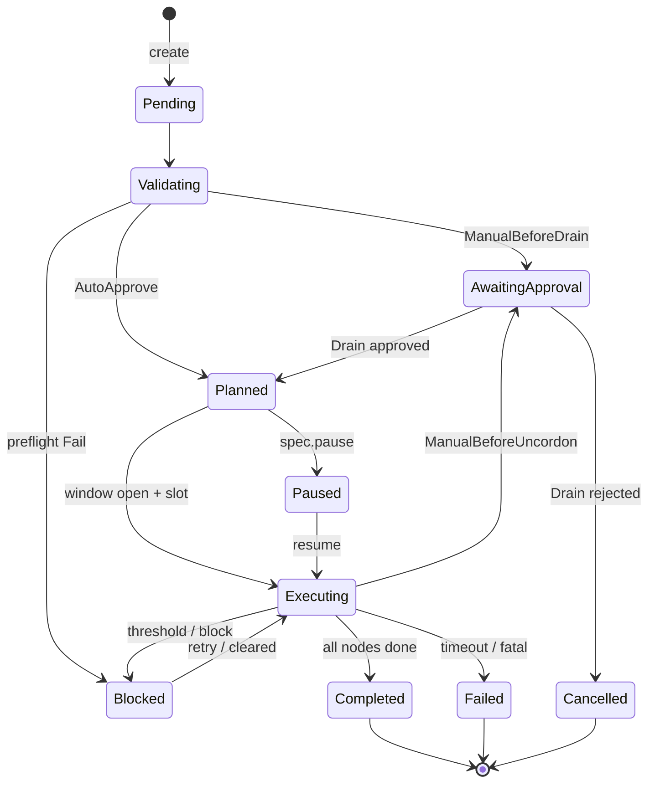

# Maintenance Orchestrator for Node/Pool Lifecycle

> 🇮🇹 Versione italiana: [`README.md`](README.md)

Cloud-native controller (Go + controller-runtime) that **safely** orchestrates node
and pool maintenance on **Kubernetes** and **OpenShift**: `cordon` → `drain` (via the
eviction API) → post-check → `uncordon`, with safety preflight checks, a planner with
risk scoring, concurrency control, maintenance windows, an optional manual-approval
workflow and a full audit trail.

It is not a `kubectl drain` wrapper: every operation is a **declarative** object
(CRD) persisted in `etcd`, reconciled **idempotently** and resilient to restarts.
The "API" is the CRD itself; operations (approve / reject / pause / resume / cancel)
are expressed as patches to `spec`.

> **Status:** `v1alpha1` (alpha). Detailed design in [`docs/DESIGN.en.md`](docs/DESIGN.en.md).

---

## Table of contents

- [Goal](#goal)
- [Features](#features)
- [Architecture](#architecture)
- [Repository layout](#repository-layout)
- [Prerequisites](#prerequisites)
- [Build and development](#build-and-development)
- [Configuration](#configuration)
- [Deploy on Kubernetes](#deploy-on-kubernetes)
- [Deploy on OpenShift](#deploy-on-openshift)
- [API / CRD model](#api--crd-model)
- [Operations](#operations)
- [Lifecycle and state machine](#lifecycle-and-state-machine)
- [Preflight checks](#preflight-checks)
- [Policy guardrails](#policy-guardrails)
- [Observability](#observability)
- [RBAC](#rbac)
- [End-to-end workflow](#end-to-end-workflow)
- [Known limitations](#known-limitations)
- [Roadmap](#roadmap)
- [Troubleshooting](#troubleshooting)
- [License](#license)

---

## Goal

Reduce operational risk during cordon, drain, uncordon, rolling maintenance, node
replacement and pool maintenance windows by providing: safety preflight checks, an
explicit execution order, concurrency limits, blocking of dangerous operations, an
optional manual approval step, and a complete audit trail.

## Features

- **2 cluster-scoped CRDs** (`maintenance.platform.dev/v1alpha1`): `MaintenanceRequest`
  (`mreq`) and `MaintenancePolicy` (`mpol`).
- **Poll-and-requeue model**: no background goroutines, no queue, no DB. All state
  lives in `.status`.
- **`policy/v1` eviction**: honors PodDisruptionBudgets; force-eviction (delete) is
  **double-gated** (`spec.force` + `policy.allowForceEviction`), off by default.
- **Three modes**: `DryRun` (report), `Advisory` (continuous monitor), `Execute`.
- **Four strategies**: `Serial`, `Batched`, `ByZone`, `ByPool`.
- **Global concurrency** guaranteed by a single leader-elected instance.
- **Cron maintenance windows** (5 fields + duration + IANA timezone).
- **Optional manual approval** before drain and/or before uncordon.
- **Risk score 0–100** and impact estimate in the plan (useful in `DryRun`).
- **Coexistence** with the Machine Config Operator and the cluster-autoscaler (it
  detects and skips managed / already-`unschedulable` nodes; it does not orchestrate them).
- **Non-root** distroless runtime, compatible with the OpenShift `restricted-v2` SCC.

## Architecture

CRD + controller-runtime. Reconciler → planner/preflight/executor/policy/approval/
window/audit → `internal/kube` (the single point of cluster I/O).



The full detail (component/sequence diagrams, per-state semantics, requirement →
component traceability) is in [`docs/DESIGN.en.md`](docs/DESIGN.en.md).

## Repository layout

```
maintenance-orchestrator/
├── go.mod / go.sum / Makefile / Dockerfile / README.md
├── api/v1alpha1/            # CRD types + deepcopy
├── cmd/manager/main.go      # manager bootstrap
├── internal/
│   ├── config logging metrics
│   ├── kube                 # node/pod/pdb/eviction/capacity (sole cluster I/O)
│   ├── policy window approval audit
│   ├── preflight planner executor statemachine
│   └── controller           # the two reconcilers + targets/phases/execute
├── deploy/
│   ├── crd/                 # 2 CRDs
│   ├── rbac/                # SA, ClusterRole(+Binding), leader-election Role(+Binding)
│   ├── manager/             # namespace, configmap, deployment, service, networkpolicy, servicemonitor
│   └── samples/             # policy + MaintenanceRequest examples
├── hack/                    # boilerplate.go.txt, config.local.yaml
└── docs/DESIGN.md
```

## Prerequisites

- Go **1.22+**
- A Kubernetes **≥ 1.22** or OpenShift **≥ 4.9** cluster (`policy/v1` eviction)
- `kubectl` / `oc`, `make`, Docker or Podman to build the image
- (optional) Prometheus Operator for the `ServiceMonitor`; a CNI that enforces
  `NetworkPolicy`

## Build and development

```bash
make tidy          # generate go.sum and the indirect dependencies (needs network)
make build         # binary in bin/manager
make test          # unit tests (fmt + vet + go test ./...)
make run           # run against the current kubeconfig (hack/config.local.yaml)
make generate      # regenerate zz_generated.deepcopy.go from kubebuilder markers
make manifests     # regenerate CRDs (deploy/crd) and ClusterRole (deploy/rbac/role.yaml)
make docker-build IMG=registry.example.com/maintenance-orchestrator:v0.1.0
make docker-push   IMG=registry.example.com/maintenance-orchestrator:v0.1.0
make test-integration  # envtest integration tests (downloads envtest binaries)
```

> **`go.sum` note:** the repository ships the sources but not `go.sum`. Run
> `make tidy` (with access to `proxy.golang.org`) before the first `make build` /
> `docker build`.

### Local run

```bash
make install       # apply the CRDs to the current cluster
make run           # leader election off, console logs, against your kubeconfig
```

## Configuration

Precedence: **defaults → YAML file (`--config` / `CONFIG_FILE`) → environment variables**.

| Variable                  | Default                                               | Description                                   |
|---------------------------|-------------------------------------------------------|-----------------------------------------------|
| `METRICS_ADDR`            | `:8080`                                                | Bind address of `/metrics`                    |
| `PROBE_ADDR`              | `:8081`                                                | Bind address of `/healthz` and `/readyz`      |
| `LEADER_ELECTION`         | `true`                                                 | Enable leader election                        |
| `LEADER_ELECTION_ID`      | `maintenance-orchestrator.maintenance.platform.dev`   | Lease name                                    |
| `RECONCILE_CONCURRENCY`   | `2`                                                    | Concurrent reconciles per controller          |
| `EVICTION_POLL_INTERVAL`  | `5s`                                                   | Re-check of a draining node                   |
| `GLOBAL_REQUEUE_INTERVAL` | `30s`                                                  | Steady-state requeue for active requests      |
| `DEFAULT_DRAIN_TIMEOUT`   | `15m`                                                  | Per-node drain timeout (when unset in spec)   |
| `DEFAULT_GLOBAL_TIMEOUT`  | `2h`                                                   | Global request timeout (when unset in spec)   |
| `LOG_LEVEL`               | `info`                                                 | `debug` / `info` / `warn` / `error`           |
| `LOG_FORMAT`              | `json`                                                 | `json` / `console`                            |
| `ENABLE_K8S_EVENTS`       | `true`                                                 | Emit Kubernetes Events                        |
| `DEFAULT_POLICY_NAME`     | `cluster-default`                                      | Policy used when `policyRef` is omitted       |
| `AUDIT_EXPORT_PATH`       | _(empty)_                                              | JSON-lines file the audit logger appends to   |
| `DEFAULT_POOL_KEYS`       | well-known pool labels (OCP, EKS, GKE, AKS, Karpenter) | Node-label keys treated as pool keys (CSV)    |

## Deploy on Kubernetes

> 📘 **Complete, precise install guide** (prerequisites, image, 3 methods, verification,
> config, OpenShift, upgrade, uninstall, troubleshooting): [`docs/INSTALL.md`](docs/INSTALL.md).

```bash
# 1) Image: build and push to a registry reachable from the cluster
make docker-build docker-push IMG=registry.example.com/maintenance-orchestrator:v0.1.0

# 2) CRDs
kubectl apply -f deploy/crd

# 3) Namespace + RBAC (SA, ClusterRole/Binding, leader-election Role/Binding)
kubectl apply -f deploy/manager/namespace.yaml
kubectl apply -f deploy/rbac

# 4) Default policy (the name expected by DEFAULT_POLICY_NAME)
kubectl apply -f deploy/samples/policy-cluster-default.yaml

# 5) Config + controller + metrics service
kubectl apply -f deploy/manager/configmap.yaml
kubectl apply -f deploy/manager/deployment.yaml
kubectl apply -f deploy/manager/service.yaml

# 6) Set the pushed image (the deployment ships :latest as a placeholder)
kubectl -n maintenance-orchestrator-system set image \
  deployment/maintenance-orchestrator \
  manager=registry.example.com/maintenance-orchestrator:v0.1.0

# (optional)
kubectl apply -f deploy/manager/networkpolicy.yaml
kubectl apply -f deploy/manager/servicemonitor.yaml
```

Alternatively, `kubectl apply -k deploy` (Kustomize) applies CRDs, RBAC and the
manager in one shot; then apply the default policy. `make deploy` applies namespace,
CRDs, RBAC, configmap, deployment and service.

## Deploy on OpenShift

Identical, with `oc apply`. Specific notes:

- **SCC**: the pod runs non-root, with no added capabilities, a `RuntimeDefault`
  `seccompProfile` and a read-only root FS → compatible with `restricted-v2` **without**
  a custom SCC. `runAsUser` is not pinned, so the SCC assigns an arbitrary uid.
- **Monitoring**: to scrape via user-workload-monitoring, enable it and apply
  `deploy/manager/servicemonitor.yaml`.
- **MCO**: nodes being reconfigured by the Machine Config Operator are marked
  `Skipped` to avoid interfering.
- **Machine API**: for pools, use the `machine.openshift.io/cluster-api-machineset`
  label as `poolKey` (see `deploy/samples/mreq-pool-rolling-approval.yaml`).

## API / CRD model

### MaintenanceRequest (`mreq`) — key `spec` fields

| Field | Type | Notes |
|---|---|---|
| `mode` | `DryRun`\|`Advisory`\|`Execute` | required |
| `reason`, `requestedBy` | string | required (audit) |
| `target.type` | `Node`\|`NodeSelector`\|`Pool` | + `nodeNames` / `selector` / `poolKey`+`poolValue` |
| `strategy` | `Serial`\|`Batched`\|`ByZone`\|`ByPool` | default `Serial` |
| `maxConcurrent`, `batchSize` | int | effective = `min(maxConcurrent, policy.maxConcurrentDrains)` |
| `drainTimeout`, `globalTimeout` | duration | default from config |
| `uncordonAfter` | bool | default `true` |
| `maintenanceWindow` | `{cron,duration,timeZone}` | recurring window |
| `approval.policy` | `AutoApprove`\|`ManualBeforeDrain`\|`ManualBeforeUncordon`\|`ManualBeforeBoth` | |
| `approval.gates[]` | `{gate,decision,approvedBy,reason,time}` | manual decisions |
| `pause`, `cancel` | bool | runtime control |
| `policyRef.name` | string | policy override |
| `allowControlPlane`, `force` | bool | dangerous opt-ins (gated by policy) |
| `upgrade` | {strategy,machineAPI,targetKubeletVersion,replacementTimeout} | replaces nodes after draining (see below) |

#### Kubernetes version upgrade (node replacement)

With `spec.upgrade` set, each node is **replaced** after draining instead of being
uncordoned: the orchestrator deletes the backing `Machine` (OpenShift
`machine.openshift.io` or Cluster API `cluster.x-k8s.io`) so the MachineSet
recreates it from its template — i.e. at the pool's version. Fields:
- `strategy: ReplaceNode` (only strategy).
- `machineAPI: Auto|ClusterAPI|OpenShift` — `Auto` infers it from node annotations.
- `targetKubeletVersion` (optional) — post-check: a node completes only once a
  `Ready` node reports that version; a node already at the version is skipped.
- `replacementTimeout` — max wait for the replacement node (config default otherwise).

Requires `allowNodeReplacement: true` in the policy (off by default, opt-in) and a
Machine API present. On clusters without one (e.g. `kind`) preflight returns
`MACHINE_NOT_FOUND`. Example: [`deploy/samples/mreq-pool-upgrade.yaml`](deploy/samples/mreq-pool-upgrade.yaml).

### MaintenancePolicy (`mpol`) — cluster guardrails

`protectControlPlane`, `controlPlaneNodeLabels`, `maxConcurrentDrains`,
`maxUnavailableNodes`, `maxUnavailablePercent`, `reservedNodeLabels`,
`reservedTaints`, `minCapacityHeadroomPercent`, `allowForceEviction`,
`allowNodeReplacement`, `defaultApprovalPolicy`, `allowedWindows`,
`failureThreshold`, `nodeSelector`.

Full examples in [`deploy/samples/`](deploy/samples).

## Operations

All declarative (no REST endpoint):

```bash
# create
kubectl apply -f deploy/samples/mreq-pool-rolling-approval.yaml
# inspect
kubectl get mreq                       # columns: Phase, Mode, Strategy, Total, Done, Age
kubectl describe mreq pool-rolling-approval

# approve / reject the drain gate
oc patch mreq pool-rolling-approval --type=merge \
  -p '{"spec":{"approval":{"gates":[{"gate":"Drain","decision":"Approved","approvedBy":"sre@example.com"}]}}}'

# pause / resume / cancel
kubectl patch mreq pool-rolling-approval --type=merge -p '{"spec":{"pause":true}}'
kubectl patch mreq pool-rolling-approval --type=merge -p '{"spec":{"pause":false}}'
kubectl patch mreq pool-rolling-approval --type=merge -p '{"spec":{"cancel":true}}'
```

## Lifecycle and state machine

`Pending → Validating → {AwaitingApproval} → Planned → Executing → Completed`, with
`Paused`, `Blocked`, `Failed`, `Cancelled`. Terminal states: `Completed`, `Failed`,
`Cancelled`. Transitions are validated in `internal/statemachine`; each node has a
sub-machine `Pending → Cordoning → Draining → PostCheck → Uncordoning → Completed`
(plus `Blocked`/`Failed`/`Skipped`); `upgrade` requests use
`PostCheck → Replacing → AwaitingReplacement → Completed`. Per-state detail in `docs/DESIGN.en.md`.

## Preflight checks

Each check produces a `status` (Pass/Warn/Fail), a `code` and structured details.

| Code | Typical severity | Meaning |
|---|---|---|
| `NODE_NOT_FOUND` | Fail | target node does not exist |
| `NODE_NOT_READY` | Warn | node not `Ready` |
| `ALREADY_CORDONED` | Warn | node already `unschedulable` |
| `CONTROL_PLANE_PROTECTED` | Fail | control-plane node protected by policy |
| `RESERVED_LABEL` / `RESERVED_TAINT` | Fail | reserved label/taint |
| `PDB_BLOCKS` | Warn | a PDB allows no disruptions |
| `SINGLE_REPLICA_WORKLOAD` | Warn | single-replica / unmanaged workload |
| `EMPTYDIR_DATA_LOSS` | Warn | pod with `emptyDir` |
| `LOCAL_STORAGE_RISK` | Warn | pod with `hostPath` |
| `DAEMONSET_PODS` | Pass | DaemonSets ignored (like `kubectl drain`) |
| `STATIC_POD` | Warn | static/mirror pod, not evictable |
| `INSUFFICIENT_CAPACITY` | Fail | estimated headroom below threshold |
| `TOO_MANY_UNAVAILABLE` | Fail | peak simultaneous unavailability (concurrency, if uncordon) would exceed the cap |
| `WINDOW_CLOSED` | Warn | outside the maintenance window |
| `MCO_MANAGED` | Warn | node being reconfigured by MCO (will be `Skipped`) |
| `MACHINE_NOT_FOUND` | Fail | upgrade requested but no Machine backs the node |
| `ALREADY_AT_TARGET_VERSION` | Warn | node already at the target version (will be `Skipped`) |
| `REPLACEMENT_NOT_ALLOWED` | Fail | `spec.upgrade` but policy lacks `allowNodeReplacement` |

A single `Fail` moves the request to `Blocked` (in `Execute`).

## Policy guardrails

- **Control-plane**: drainable only if `policy.protectControlPlane=false` **and**
  `request.allowControlPlane=true` (double gate).
- **Concurrency**: `min(request.maxConcurrent, policy.maxConcurrentDrains)`.
- **Max unavailable**: combines the absolute and percentage caps (most restrictive, min 1).
- **Capacity**: heuristic request-based check against `minCapacityHeadroomPercent`.
- **Force**: only with `policy.allowForceEviction=true` **and** `request.force=true`.
- **Failure threshold**: `policy.failureThreshold` node failures → request `Failed`.

## Observability

Prometheus metrics on `:8080/metrics`:

| Metric | Type | Labels |
|---|---|---|
| `maintenance_requests_total` | counter | `mode`, `target_type` |
| `maintenance_success_total` | counter | — |
| `maintenance_failure_total` | counter | `reason` |
| `drain_duration_seconds` | histogram | `result` |
| `preflight_failures_total` | counter | `check` |
| `blocked_drains_total` | counter | `reason` |
| `active_maintenances` | gauge | — |
| `maintenance_node_replacements_total` | counter | result |

Health: `:8081/healthz` (liveness), `:8081/readyz` (readiness). Audit: structured
JSON logs, optional Kubernetes Events (`ENABLE_K8S_EVENTS`) and optional JSON-lines
export (`AUDIT_EXPORT_PATH`, mount a writable volume).

## Web dashboard (UI)

A built-in, server-side Go dashboard (`html/template` + vanilla JS, no Node/build
step) lives in the manager binary. Enable it with `uiEnabled: true` / `UI_ENABLED`
(port `uiAddr`, default `:8082`). It lists requests with **live** status/progress
(3s auto-refresh), shows the detail (preflight, plan, per-node, conditions),
**creates** requests, and runs the **approve/reject/pause/resume/cancel** actions.
Policies are read-only.

> ⚠️ **No authentication**: exposed only on a `ClusterIP` Service. Reach it via
> `kubectl -n maintenance-orchestrator-system port-forward svc/maintenance-orchestrator-ui 8082:8082`
> then http://localhost:8082 — or place it behind an authenticating ingress.
> `uiEnabled: false` disables it entirely.

## RBAC

Minimal ClusterRole: `maintenancerequests`/`maintenancepolicies` (+`/status`);
`nodes` get/list/watch/**patch**; `pods` get/list/watch/**delete** (force only);
`pods/eviction` **create**; `poddisruptionbudgets` get/list/watch;
`apps/{deployments,replicasets,statefulsets,daemonsets}` read; `events` create/patch.
Leader election (`leases`) confined to the controller namespace.

## End-to-end workflow

1. Apply the policy (`policy-cluster-default`) and a `MaintenanceRequest` in `DryRun`
   to get preflight + plan + risk score in `.status` with no mutations.
2. Switch to `Execute` (or create a new request) with the desired strategy and
   window; with `approval.policy: ManualBeforeDrain`, the request enters
   `AwaitingApproval`.
3. Approve the gate with `oc patch`. The controller cordons and evacuates per batch
   respecting concurrency, PDBs and the window, updating `.status.nodes`/`summary`.
4. Once drained it uncordons (if `uncordonAfter` and the Uncordon gate is satisfied);
   the request becomes `Completed`. Non-evictable nodes → `Blocked` (retried within
   the global timeout) or `Failed` beyond the threshold.

## Known limitations

- **Heuristic capacity check** (sum of `requests`), not a scheduler simulation.
- **Pools inferred from labels** (`DEFAULT_POOL_KEYS`), no cloud/Machine API integration.
- **No companion REST**: operations are CRD patches (by design).
- **Single CRD version** (`v1alpha1`), no conversion/webhook.
- **Capped `.status`** (preflight truncated to 200 results) to keep the object small.
- **`Blocked` nodes** are retried until the global timeout fires; there is no separate
  per-node backoff.

## Roadmap

- Validating/defaulting admission webhook (spec validation at the API).
- Conversion and `v1beta1`.
- Machine API / Cluster API integration for node drain → delete → replace.
- Companion CLI / `kubectl` plugin for approvals and reports.
- OpenTelemetry tracing.
- Configurable per-node backoff and retry policy.

## Troubleshooting

| Symptom | Likely cause / fix |
|---|---|
| `go build` fails on dependencies | run `make tidy` (needs `go.sum`, requires network) |
| CRDs not recognized | `kubectl apply -f deploy/crd` before the CRs |
| Request stuck in `Pending` | controller not running / missing RBAC: check the deployment logs |
| `Blocked` with `CONTROL_PLANE_PROTECTED` | set `policy.protectControlPlane=false` **and** `request.allowControlPlane=true` |
| Drain stalls, `blocked_drains_total{reason="PDB"}` | a PDB allows no disruptions: raise replicas or `minAvailable` |
| No execution, `WINDOW_CLOSED` | outside the window: wait for it to open or adjust `maintenanceWindow`/`allowedWindows` |
| Multiple replicas but only one works | expected: leader election (only the leader reconciles) |
| Metrics not scraped | check the `ServiceMonitor`/`serviceMonitorSelector` and the `NetworkPolicy` |
| `Pending` on a fresh cluster with no policy | create `policy-cluster-default` or set `DEFAULT_POLICY_NAME` |

## License

Apache-2.0 (see the `hack/boilerplate.go.txt` header).

