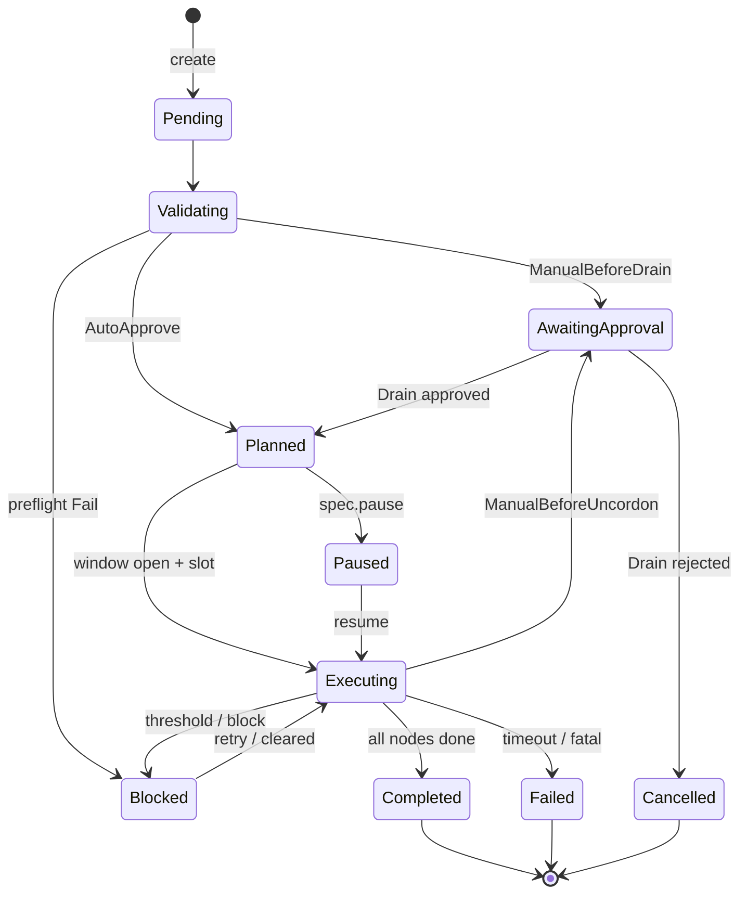

# Maintenance Orchestrator for Node/Pool Lifecycle
Controller cloud-native (Go + controller-runtime) che orchestra **in sicurezza** la
manutenzione di nodi e pool su **Kubernetes** e **OpenShift**: `cordon` -> `drain`
(via eviction API) -> post-check -> `uncordon`, con preflight di sicurezza, planner
con risk score, controllo della concorrenza, finestre di manutenzione, workflow di
approvazione manuale e audit completo.
Non e un wrapper di `kubectl drain`: ogni operazione e un oggetto **dichiarativo**
(CRD) persistito in `etcd`, riconciliato in modo **idempotente** e resistente ai
restart. L'"API" e la CRD stessa; le operazioni (approve / reject / pause / resume /
cancel) si esprimono come patch di `spec`.
> **Stato:** `v1alpha1` (alpha). Design di dettaglio in [`docs/DESIGN.md`](docs/DESIGN.md).
---
## Obiettivo
Ridurre il rischio operativo durante cordon, drain, uncordon, rolling maintenance,
node replacement e finestre di manutenzione di pool, fornendo: preflight di
sicurezza, ordine di esecuzione esplicito, limiti di concorrenza, blocco delle
operazioni pericolose, approvazione manuale opzionale e audit trail completo.
## Caratteristiche
- **2 CRD cluster-scoped** (`maintenance.platform.dev/v1alpha1`): `MaintenanceRequest`
  (`mreq`) e `MaintenancePolicy` (`mpol`).
- **Modello poll-and-requeue**: niente goroutine di background, niente coda, niente
  DB. Lo stato vive interamente in `.status`.
- **Eviction `policy/v1`**: rispetta i PodDisruptionBudget; la force-eviction (delete)
  e **doppiamente gated** (`spec.force` + `policy.allowForceEviction`), off di default.
- **Tre modalita**: `DryRun` (report), `Advisory` (monitor continuo), `Execute`.
- **Quattro strategie**: `Serial`, `Batched`, `ByZone`, `ByPool`.
- **Concorrenza globale** garantita da una singola istanza leader-elected.
- **Finestre cron** (5 campi + durata + timezone IANA).
- **Approvazione manuale** opzionale prima del drain e/o dell'uncordon.
- **Risk score 0-100** e stima d'impatto nel piano (utile in `DryRun`).
- **Coesistenza** con Machine Config Operator e cluster-autoscaler (li rileva e
  salta i nodi gestiti/gia `unschedulable`, non li orchestra).
- Runtime **non-root** distroless, compatibile con la SCC OpenShift `restricted-v2`.
## Architettura
CRD + controller-runtime. Reconciler -> planner/preflight/executor/policy/approval/
window/audit -> `internal/kube` (unico punto di I/O verso il cluster).

Il dettaglio completo (diagrammi componenti/sequence, semantica per-stato,
tracciabilita requisiti->componenti) e in [`docs/DESIGN.md`](docs/DESIGN.md).
## Struttura del repository
```
maintenance-orchestrator/
- go.mod / go.sum / Makefile / Dockerfile / README.md
- api/v1alpha1/            # tipi CRD + deepcopy
- cmd/manager/main.go      # bootstrap del manager
- internal/
  - config logging metrics
  - kube                   # node/pod/pdb/eviction/capacity (unico I/O cluster)
  - policy window approval audit
  - preflight planner executor statemachine
  - controller             # i due reconciler + targets/phases/execute
- deploy/
  - crd/                   # 2 CRD
  - rbac/                  # SA, ClusterRole(+Binding), leader-election Role(+Binding)
  - manager/               # namespace, configmap, deployment, service, networkpolicy, servicemonitor
  - samples/               # policy + esempi MaintenanceRequest
- hack/                    # boilerplate.go.txt, config.local.yaml
- docs/DESIGN.md
```
## Prerequisiti
- Go **1.22+**
- Cluster Kubernetes **>= 1.22** o OpenShift **>= 4.9** (eviction `policy/v1`)
- `kubectl` / `oc`, `make`, Docker o Podman per l'immagine
- (opzionale) Prometheus Operator per il `ServiceMonitor`; un CNI che applichi le
  `NetworkPolicy`
## Build e sviluppo
```bash
make tidy          # genera go.sum e le dipendenze indirette (richiede rete)
make build         # binario in bin/manager
make test          # unit test (fmt + vet + go test ./...)
make run           # esegue contro il kubeconfig corrente (hack/config.local.yaml)
make generate      # rigenera zz_generated.deepcopy.go dai marker kubebuilder
make manifests     # rigenera CRD (deploy/crd) e ClusterRole (deploy/rbac/role.yaml)
make docker-build IMG=registry.example.com/maintenance-orchestrator:v0.1.0
make docker-push   IMG=registry.example.com/maintenance-orchestrator:v0.1.0
```
> **Nota `go.sum`:** il repository fornisce i sorgenti ma non `go.sum`. Esegui
> `make tidy` (con accesso a `proxy.golang.org`) prima del primo `make build` /
> `docker build`.
### Esecuzione locale
```bash
make install       # applica le CRD al cluster corrente
make run           # leader election off, log console, contro il tuo kubeconfig
```
## Configurazione
Precedenza: **default -> file YAML (`--config` / `CONFIG_FILE`) -> variabili d'ambiente**.
| Variabile                 | Default                                               | Descrizione                                   |
|---------------------------|-------------------------------------------------------|-----------------------------------------------|
| `METRICS_ADDR`            | `:8080`                                                | Bind address di `/metrics`                    |
| `PROBE_ADDR`              | `:8081`                                                | Bind address di `/healthz` e `/readyz`        |
| `LEADER_ELECTION`         | `true`                                                 | Abilita la leader election                    |
| `LEADER_ELECTION_ID`      | `maintenance-orchestrator.maintenance.platform.dev`   | Nome del Lease                                |
| `RECONCILE_CONCURRENCY`   | `2`                                                    | Reconcile concorrenti per controller          |
| `EVICTION_POLL_INTERVAL`  | `5s`                                                   | Ricontrollo di un nodo in drain               |
| `GLOBAL_REQUEUE_INTERVAL` | `30s`                                                  | Requeue a regime per richieste attive         |
| `DEFAULT_DRAIN_TIMEOUT`   | `15m`                                                  | Timeout drain per nodo (se non in spec)        |
| `DEFAULT_GLOBAL_TIMEOUT`  | `2h`                                                   | Timeout globale richiesta (se non in spec)     |
| `LOG_LEVEL`               | `info`                                                 | debug / info / warn / error                    |
| `LOG_FORMAT`              | `json`                                                 | json / console                                 |
| `ENABLE_K8S_EVENTS`       | `true`                                                 | Emissione di Event Kubernetes                 |
| `DEFAULT_POLICY_NAME`     | `cluster-default`                                      | Policy usata senza `policyRef`                |
| `AUDIT_EXPORT_PATH`       | _(vuoto)_                                              | File JSON-lines su cui appende l'audit         |
| `DEFAULT_POOL_KEYS`       | label di pool note (OCP, EKS, GKE, AKS, Karpenter)     | Chiavi label trattate come pool (CSV)         |
## Deploy su Kubernetes
```bash
# 1) Immagine: build e push su un registry raggiungibile dal cluster
make docker-build docker-push IMG=registry.example.com/maintenance-orchestrator:v0.1.0
# 2) CRD
kubectl apply -f deploy/crd
# 3) Namespace + RBAC (SA, ClusterRole/Binding, leader-election Role/Binding)
kubectl apply -f deploy/manager/namespace.yaml
kubectl apply -f deploy/rbac
# 4) Policy di default (nome atteso da DEFAULT_POLICY_NAME)
kubectl apply -f deploy/samples/policy-cluster-default.yaml
# 5) Config + controller + service metriche
kubectl apply -f deploy/manager/configmap.yaml
kubectl apply -f deploy/manager/deployment.yaml
kubectl apply -f deploy/manager/service.yaml
# 6) Imposta l'immagine pushata (la deployment usa :latest come placeholder)
kubectl -n maintenance-orchestrator-system set image \
  deployment/maintenance-orchestrator \
  manager=registry.example.com/maintenance-orchestrator:v0.1.0
# (opzionali)
kubectl apply -f deploy/manager/networkpolicy.yaml
kubectl apply -f deploy/manager/servicemonitor.yaml
```
In alternativa `make deploy` applica namespace, CRD, RBAC, configmap, deployment e
service (ricorda comunque la policy di default e l'immagine).
## Deploy su OpenShift
Identico, con `oc apply`. Note specifiche:
- **SCC**: il pod gira non-root, senza capability aggiunte, con `seccompProfile`
  `RuntimeDefault` e root FS read-only -> compatibile con `restricted-v2` **senza**
  SCC custom. Non viene fissato `runAsUser`, cosi la SCC assegna un uid arbitrario.
- **Monitoring**: per lo scrape via user-workload-monitoring abilita quel
  monitoring e applica `deploy/manager/servicemonitor.yaml`.
- **MCO**: i nodi in aggiornamento Machine Config vengono marcati `Skipped` per non
  interferire.
- **Machine API**: per i pool usa la label `machine.openshift.io/cluster-api-machineset`
  come `poolKey` (vedi `deploy/samples/mreq-pool-rolling-approval.yaml`).
## Modello API / CRD
### MaintenanceRequest (`mreq`) - campi principali di `spec`
| Campo | Tipo | Note |
|---|---|---|
| `mode` | DryRun/Advisory/Execute | obbligatorio |
| `reason`, `requestedBy` | string | obbligatori (audit) |
| `target.type` | Node/NodeSelector/Pool | + `nodeNames` / `selector` / `poolKey`+`poolValue` |
| `strategy` | Serial/Batched/ByZone/ByPool | default `Serial` |
| `maxConcurrent`, `batchSize` | int | effettiva = min(maxConcurrent, policy.maxConcurrentDrains) |
| `drainTimeout`, `globalTimeout` | duration | default da config |
| `uncordonAfter` | bool | default `true` |
| `maintenanceWindow` | {cron,duration,timeZone} | finestra ricorrente |
| `approval.policy` | AutoApprove/ManualBeforeDrain/ManualBeforeUncordon/ManualBeforeBoth | |
| `approval.gates[]` | {gate,decision,approvedBy,reason,time} | decisioni manuali |
| `pause`, `cancel` | bool | controllo runtime |
| `policyRef.name` | string | override della policy |
| `allowControlPlane`, `force` | bool | opt-in pericolosi (gated da policy) |
| `upgrade` | {strategy,machineAPI,targetKubeletVersion,replacementTimeout} | sostituisce i nodi dopo il drain (vedi sotto) |

#### Upgrade della versione Kubernetes (node replacement)
Impostando `spec.upgrade`, dopo il drain ogni nodo **non viene uncordonato** ma
**sostituito**: l'orchestratore elimina la `Machine` che lo regge (OpenShift
`machine.openshift.io` o Cluster API `cluster.x-k8s.io`), così il MachineSet lo
ricrea dal template — quindi alla versione del pool. Campi:
- `strategy: ReplaceNode` (unica strategia).
- `machineAPI: Auto|ClusterAPI|OpenShift` — `Auto` deduce dall'annotazione del nodo.
- `targetKubeletVersion` (opzionale) — post-check: il nodo si completa solo quando
  esiste un nodo `Ready` a quella versione; un nodo già alla versione viene saltato.
- `replacementTimeout` — attesa massima per il nodo sostitutivo (default da config).

Richiede `allowNodeReplacement: true` nella policy (off di default, opt-in) e una
Machine API presente. Su cluster senza Machine API (es. `kind`) il preflight
restituisce `MACHINE_NOT_FOUND`. Esempio: [`deploy/samples/mreq-pool-upgrade.yaml`](deploy/samples/mreq-pool-upgrade.yaml).
### MaintenancePolicy (`mpol`) - guardrail di cluster
`protectControlPlane`, `controlPlaneNodeLabels`, `maxConcurrentDrains`,
`maxUnavailableNodes`, `maxUnavailablePercent`, `reservedNodeLabels`,
`reservedTaints`, `minCapacityHeadroomPercent`, `allowForceEviction`,
`allowNodeReplacement`, `defaultApprovalPolicy`, `allowedWindows`,
`failureThreshold`, `nodeSelector`.
Esempi completi in [`deploy/samples/`](deploy/samples).
## Operazioni
Tutte dichiarative (niente endpoint REST):
```bash
# creare
kubectl apply -f deploy/samples/mreq-pool-rolling-approval.yaml
# ispezionare
kubectl get mreq
kubectl describe mreq pool-rolling-approval
# approvare / rifiutare il gate di drain
oc patch mreq pool-rolling-approval --type=merge \
  -p '{"spec":{"approval":{"gates":[{"gate":"Drain","decision":"Approved","approvedBy":"sre@example.com"}]}}}'
# pause / resume / cancel
kubectl patch mreq pool-rolling-approval --type=merge -p '{"spec":{"pause":true}}'
kubectl patch mreq pool-rolling-approval --type=merge -p '{"spec":{"pause":false}}'
kubectl patch mreq pool-rolling-approval --type=merge -p '{"spec":{"cancel":true}}'
```
## Lifecycle e state machine
`Pending -> Validating -> {AwaitingApproval} -> Planned -> Executing -> Completed`, con
`Paused`, `Blocked`, `Failed`, `Cancelled`. Stati terminali: `Completed`, `Failed`,
`Cancelled`. Le transizioni sono validate in `internal/statemachine`; ogni nodo ha
una sotto-macchina `Pending -> Cordoning -> Draining -> PostCheck -> Uncordoning ->
Completed` (con `Blocked`/`Failed`/`Skipped`); per le richieste `upgrade` la coda è
`PostCheck -> Replacing -> AwaitingReplacement -> Completed`. Dettaglio per-stato in `docs/DESIGN.md`.
## Preflight checks
Ogni check produce `status` (Pass/Warn/Fail), un `code` e dettagli strutturati.
| Code | Severita tipica | Significato |
|---|---|---|
| `NODE_NOT_FOUND` | Fail | nodo target inesistente |
| `NODE_NOT_READY` | Warn | nodo non `Ready` |
| `ALREADY_CORDONED` | Warn | nodo gia `unschedulable` |
| `CONTROL_PLANE_PROTECTED` | Fail | nodo control-plane protetto da policy |
| `RESERVED_LABEL` / `RESERVED_TAINT` | Fail | label/taint riservati |
| `PDB_BLOCKS` | Warn | un PDB non consente disruzioni |
| `SINGLE_REPLICA_WORKLOAD` | Warn | workload a replica singola / pod non gestito |
| `EMPTYDIR_DATA_LOSS` | Warn | pod con `emptyDir` |
| `LOCAL_STORAGE_RISK` | Warn | pod con `hostPath` |
| `DAEMONSET_PODS` | Pass | DaemonSet ignorati (come `kubectl drain`) |
| `STATIC_POD` | Warn | static/mirror pod non evacuabili |
| `INSUFFICIENT_CAPACITY` | Fail | headroom stimato sotto soglia |
| `TOO_MANY_UNAVAILABLE` | Fail | il picco simultaneo (concorrenza, se uncordon) supererebbe il cap |
| `WINDOW_CLOSED` | Warn | fuori finestra di manutenzione |
| `MCO_MANAGED` | Warn | nodo in aggiornamento MCO (sara `Skipped`) |
| `MACHINE_NOT_FOUND` | Fail | upgrade richiesto ma nessuna Machine regge il nodo |
| `ALREADY_AT_TARGET_VERSION` | Warn | nodo gia alla versione target (sara `Skipped`) |
| `REPLACEMENT_NOT_ALLOWED` | Fail | `spec.upgrade` ma policy senza `allowNodeReplacement` |
Un solo `Fail` porta la richiesta in `Blocked` (in `Execute`).
## Guardrail di policy
- **Control-plane**: drenabile solo se `policy.protectControlPlane=false` **e**
  `request.allowControlPlane=true` (doppio gate).
- **Concorrenza**: min(request.maxConcurrent, policy.maxConcurrentDrains).
- **Max unavailable**: combina cap assoluto e percentuale (il piu restrittivo, min 1).
- **Capacita**: check euristico request-based contro `minCapacityHeadroomPercent`.
- **Force**: solo con `policy.allowForceEviction=true` **e** `request.force=true`.
- **Failure threshold**: `policy.failureThreshold` fallimenti nodo -> richiesta `Failed`.
## Osservabilita
Metriche Prometheus su `:8080/metrics`:
| Metrica | Tipo | Label |
|---|---|---|
| `maintenance_requests_total` | counter | mode, target_type |
| `maintenance_success_total` | counter | - |
| `maintenance_failure_total` | counter | reason |
| `drain_duration_seconds` | histogram | result |
| `preflight_failures_total` | counter | check |
| `blocked_drains_total` | counter | reason |
| `active_maintenances` | gauge | - |
| `maintenance_node_replacements_total` | counter | result |
Health: `:8081/healthz` (liveness), `:8081/readyz` (readiness). Audit: log JSON
strutturati, Event Kubernetes opzionali (`ENABLE_K8S_EVENTS`) ed export JSON-lines
opzionale (`AUDIT_EXPORT_PATH`, montare un volume scrivibile).
## RBAC
ClusterRole minima: `maintenancerequests`/`maintenancepolicies` (+`/status`);
`nodes` get/list/watch/**patch**; `pods` get/list/watch/**delete** (solo force);
`pods/eviction` **create**; `poddisruptionbudgets` get/list/watch;
`apps/{deployments,replicasets,statefulsets,daemonsets}` read; `events` create/patch.
Leader election (`leases`) confinata al namespace del controller.
## Flusso operativo end-to-end
1. Applica la policy (`policy-cluster-default`) e una `MaintenanceRequest` in `DryRun`
   per ottenere preflight + piano + risk score in `.status` senza mutazioni.
2. Passa a `Execute` (o crea una nuova richiesta) con la strategia e la finestra
   desiderate; se `approval.policy: ManualBeforeDrain`, la richiesta entra in
   `AwaitingApproval`.
3. Approva il gate con `oc patch`. Il controller cordona ed evacua per batch nel
   rispetto di concorrenza, PDB e finestra, aggiornando `.status.nodes`/`summary`.
4. A drain completato esegue uncordon (se `uncordonAfter` e gate Uncordon ok); la
   richiesta diventa `Completed`. Eventuali nodi non evacuabili -> `Blocked` (retry
   entro il global timeout) o `Failed` oltre la soglia.
## Limiti noti
- **Capacity check euristico** (somma delle `requests`), non una simulazione dello
  scheduler.
- **Pool inferiti da label** (`DEFAULT_POOL_KEYS`), nessuna integrazione con le API
  cloud/Machine.
- **Nessuna companion REST**: le operazioni sono patch CRD (per design).
- **Single version** CRD (`v1alpha1`), nessuna conversione/webhook.
- **`.status` limitato** (preflight troncato a 200 risultati) per non gonfiare l'oggetto.
- I **nodi `Blocked`** vengono ritentati finche non scatta il global timeout; non
  esiste backoff per-nodo configurabile separato.
## Roadmap
- Validating/defaulting admission webhook (validazione spec lato API).
- Conversione e `v1beta1`.
- Integrazione Machine API/Cluster API per drain->delete->replace del nodo.
- Companion CLI/`kubectl` plugin per approvazioni e report.
- Tracing OpenTelemetry.
- Backoff per-nodo e retry policy configurabili.
## Troubleshooting
| Sintomo | Causa probabile / rimedio |
|---|---|
| `go build` fallisce su dipendenze | esegui `make tidy` (serve `go.sum`, richiede rete) |
| CRD non riconosciute | `kubectl apply -f deploy/crd` prima delle CR |
| Richiesta ferma in `Pending` | controller non in esecuzione / RBAC mancante: vedi i log del deployment |
| `Blocked` con `CONTROL_PLANE_PROTECTED` | imposta `policy.protectControlPlane=false` **e** `request.allowControlPlane=true` |
| Drain non avanza, `blocked_drains_total{reason=PDB}` | un PDB non consente disruzioni: aumenta repliche o minAvailable |
| Niente esecuzione, `WINDOW_CLOSED` | fuori finestra: attendi l'apertura o modifica la finestra |
| Piu repliche ma una sola lavora | atteso: leader election (solo il leader riconcilia) |
| Metriche non raccolte | verifica ServiceMonitor/serviceMonitorSelector e la NetworkPolicy |
| `Pending` su cluster nuovo senza policy | crea `policy-cluster-default` o imposta `DEFAULT_POLICY_NAME` |
## Licenza
Apache-2.0 (vedi header `hack/boilerplate.go.txt`).