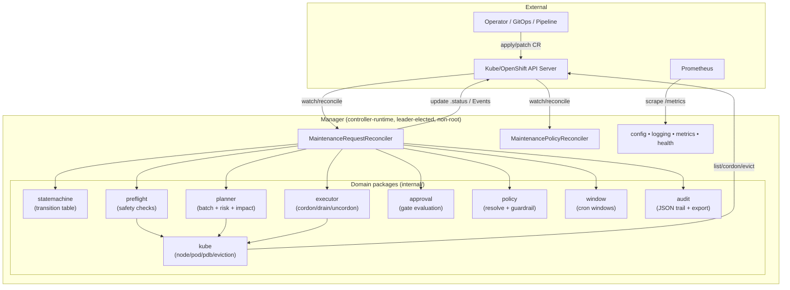
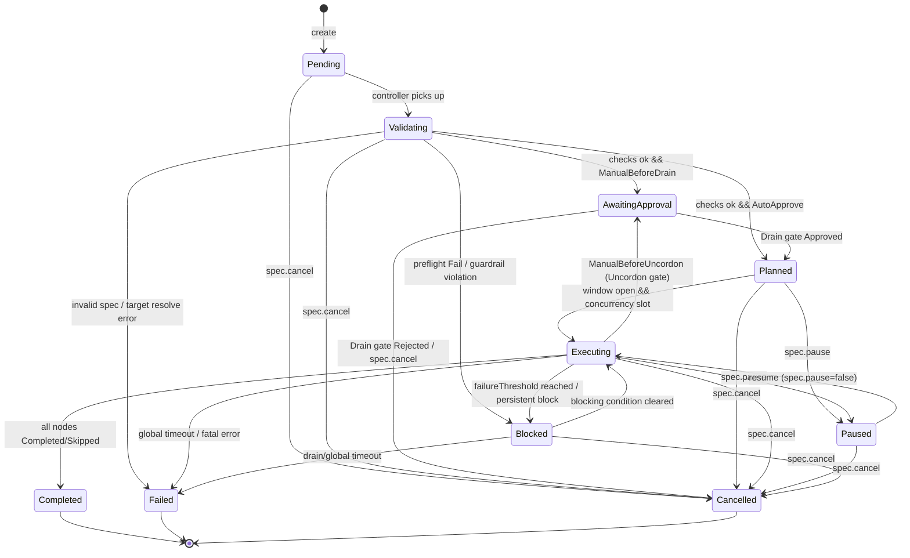
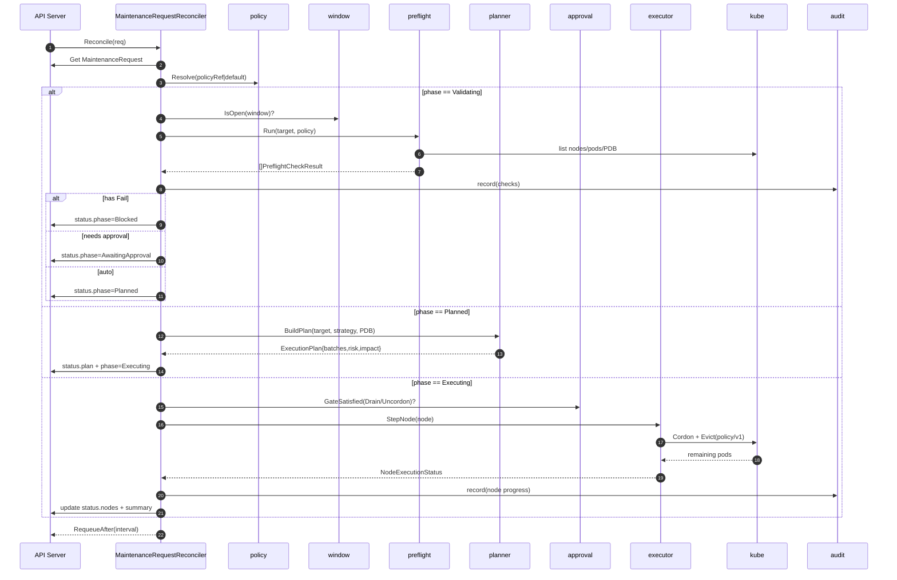

# STEP 1 — Design: Maintenance Orchestrator for Node/Pool Lifecycle

> 🇮🇹 Italian version: [`DESIGN.md`](DESIGN.md)
>
> Authoritative design document for `maintenance.platform.dev/v1alpha1`.
> Language: **Go** + **controller-runtime**. Target: **Kubernetes** vanilla and
> **OpenShift**, **in-cluster** deployment.

---

## 1. Architectural decision

**Choice: Option 1 — CRD-based controller (kubebuilder-style).**

The state of the whole maintenance operation lives in a declarative object
(`MaintenanceRequest`) persisted in `etcd`; the controller reconciles it
idempotently. "Operations" (approve/reject/pause/resume/cancel) are not RPC calls
but **declarative mutations of `spec`** applied with `kubectl/oc patch`.

### 1.1 Comparing the two options

| Criterion | Option 1 — CRD + controller (**chosen**) | Option 2 — Standalone REST + internal reconciler |
|---|---|---|
| State persistence | `etcd` via the API server (no DB) | External DB or custom storage to operate |
| Restart resilience | Native: state is in `.status`, resumes from the last point | Build it yourself (WAL/journal, recovery) |
| Concurrency / HA | controller-runtime leader election (single active) | Custom distributed lock + queue |
| RBAC / AuthN / AuthZ | Native Kubernetes (Role/ClusterRole, SubjectAccessReview) | Build it (tokens, middleware, audit) |
| Audit | API server audit log + Events + managedFields | Build it |
| Operator UX | `kubectl/oc get/describe/patch`, GitOps/ArgoCD | Dedicated client/SDK |
| Idempotency | Reconciliation model, by design | Guarantee it manually |
| Operational cost | Low: a single Deployment | Higher: service + DB + ingress + auth |
| Main drawback | No long-running blocking → requires *poll-and-requeue* | Larger surface and infra code |

### 1.2 Why CRD wins here

- **Zero extra infrastructure**: no DB, no queue, no ingress. A single
  leader-elected Deployment. Enforcing **global drain concurrency** is trivial
  because there is **only one active instance**.
- **Native operational security**: every transition goes through the API server →
  lands in the cluster **audit log**; RBAC is Kubernetes' own (no custom authz).
- **GitOps-friendly**: a `MaintenanceRequest` is a manifest; it can come from a
  pipeline, ArgoCD, ticket automation. Approvals are traceable, signable `patch`es.
- **OpenShift compatibility**: CRDs and controllers are OCP's native operating
  model; the runtime runs non-root under the `restricted-v2` SCC.

### 1.3 Drawbacks and mitigations

| CRD-model drawback | Adopted mitigation |
|---|---|
| No long blocking operations in `Reconcile` | **Poll-and-requeue**: a drain does not block; eviction is started, control returns, and the node is re-observed after `EvictionPollInterval` |
| `.status` can grow | Cap on `status.preflight`/`status.nodes`; bulky detail only in audit/logs |
| The "API" is not an HTTP endpoint | Operations mapped to `spec` fields + `kubectl/oc patch` examples; an **optional REST companion** is on the roadmap, not required |
| No synchronous "submit" with an immediate response | `DryRun`/`Advisory` produce the verdict in `.status` within a few reconciles |

---

## 2. Execution model: *poll-and-requeue*

No background goroutines, no external queue. `Reconcile` is a function that is
**pure with respect to observed state**: it reads the `MaintenanceRequest` + the
cluster, computes the next step, writes `.status`, and returns a `RequeueAfter`.

```
Reconcile(req):
  obj   := get(MaintenanceRequest)
  pol   := resolvePolicy(obj)                 # internal/policy
  switch obj.status.phase:
    Pending           -> validate + window     # -> Validating
    Validating        -> preflight + guardrail  # -> AwaitingApproval | Planned | Blocked | Failed
    AwaitingApproval  -> read spec.approval     # -> Planned | Cancelled
    Planned           -> plan + open window?    # -> Executing | Paused
    Executing         -> step batch (cordon/drain/postcheck/uncordon)
                                                # -> Executing | AwaitingApproval(Uncordon) | Completed | Blocked | Failed
    Paused            -> wait resume/cancel     # -> Executing | Cancelled
    Blocked           -> re-evaluate            # -> Executing | Failed | Cancelled
    terminal          -> noop
  writeStatus(obj)
  return RequeueAfter(interval)
```

A drain's progress is observed, not awaited: pod evictions are started, control
**returns**, and on the next reconcile the remaining pods are counted. This makes
the controller resilient to restarts (it resumes by reading `.status`) and consumes
no workers.

---

## 3. Component diagram



---

## 4. Lifecycle state machine

The values match `api/v1alpha1` (`Phase`): `Pending`, `Validating`,
`AwaitingApproval`, `Planned`, `Executing`, `Paused`, `Blocked`, `Completed`,
`Failed`, `Cancelled`.



### 4.1 Per-state semantics (entry / exit / audit / metrics)

| State | When it is entered | When it is left | Audit written | Metrics updated |
|---|---|---|---|---|
| **Pending** | On CR creation (empty status) | As soon as the controller observes it | `request.created` (id, mode, target, requestedBy, reason) | `maintenance_requests_total{mode,target_type}` ++ ; `active_maintenances` set |
| **Validating** | From Pending | After preflight + guardrail | `validating.start`, one record per check (`code`, `status`, `node`) | `preflight_failures_total{check}` ++ for each `Fail` |
| **AwaitingApproval** | Validation ok and the policy requires a gate (Drain or Uncordon) | When the matching `GateDecision` arrives | `approval.requested{gate}` | — (the `active_maintenances` gauge stays) |
| **Planned** | Auto-approve or Drain gate approved | Window open + a concurrency slot available | `plan.generated` (batches, riskScore, impact) | — |
| **Executing** | From Planned (or returning from Paused/Blocked/uncordon gate) | All nodes terminal, or error/timeout | `node.cordon`, `node.drain.progress`, `node.evicted`, `node.uncordon` | `drain_duration_seconds{result}` observed at node end ; `blocked_drains_total{reason}` ++ on a block |
| **Paused** | `spec.pause=true` | `spec.pause=false` (resume) or cancel | `request.paused{by}` | — |
| **Blocked** | Preflight `Fail` that cannot be cleared, or an execution block (PDB, capacity…) past threshold | Condition clears, or timeout → Failed | `request.blocked{reason}` | `blocked_drains_total{reason}` ++ |
| **Completed** | All nodes `Completed`/`Skipped` | Terminal | `request.completed{summary}` | `maintenance_success_total` ++ ; `active_maintenances` -- |
| **Failed** | Global timeout, failure threshold, fatal error | Terminal | `request.failed{reason}` | `maintenance_failure_total{reason}` ++ ; `active_maintenances` -- |
| **Cancelled** | `spec.cancel=true` or gate `Rejected` | Terminal | `request.cancelled{by}` | `active_maintenances` -- |

In parallel, `status.conditions[]` (standard `metav1.Condition` type) reflects:
`Validated`, `Approved`, `Planned`, `Executing`, `WindowOpen`, `GuardrailViolation`,
`Completed`, `Blocked`, `Failed`.

---

## 5. Reconciliation flow (sequence)



---

## 6. Data model (mapped to the existing Go types)

All types live in `api/v1alpha1`. Already present and used as the source of truth:

| Concept from the prompt | Go type | File |
|---|---|---|
| MaintenanceRequest | `MaintenanceRequest` (`+kubebuilder:resource:scope=Cluster,shortName=mreq`) | `maintenancerequest_types.go` |
| MaintenanceSpec | `MaintenanceSpec` (mode, reason, requestedBy, target, strategy, maxConcurrent, batchSize, drain/globalTimeout, uncordonAfter, window, approval, pause, cancel, policyRef, allowControlPlane, force) | `maintenancerequest_types.go` |
| MaintenanceStatus | `MaintenanceStatus` (phase, conditions, startTime, completionTime, approvalGate, preflight, plan, nodes, summary, message, lastError) | `maintenancerequest_types.go` |
| TargetRef | `TargetRef` (type=Node/NodeSelector/Pool, nodeNames, selector, poolKey/poolValue) | `shared_types.go` |
| PreflightCheckResult | `PreflightCheckResult` (code, node, status=Pass/Warn/Fail, message, details, time) | `shared_types.go` |
| ExecutionPlan | `ExecutionPlan` (strategy, batches, totalNodes, maxConcurrent, riskScore, riskFactors, impact, generatedAt) | `shared_types.go` |
| NodeExecutionStatus | `NodeExecutionStatus` (node, phase, batch, start/end, total/evicted/remaining pods, blockReason, message) | `shared_types.go` |
| ApprovalStatus | `ApprovalSpec` + `GateDecision` + `status.approvalGate` (`Gate`) | `shared_types.go` |
| MaintenancePolicy | `MaintenancePolicy` (`mpol`) + `MaintenancePolicySpec` | `maintenancepolicy_types.go` |
| Config | `config.Config` (defaults → file → env) | `internal/config/config.go` |

Enums/constants already defined: `Mode`, `Strategy`, `TargetType`, `ApprovalPolicy`,
`Gate`, `Decision`, `CheckStatus`, `Phase`, `NodePhase`, the preflight `Code*`, the
`Block*` reasons and the `Cond*` condition types.

### 6.1 Operating modes

| Mode | Cluster mutations | Behavior | Outcome |
|---|---|---|---|
| `DryRun` | None | Resolves target + preflight + plan **once**, then completes | `Completed` with `status.preflight` + `status.plan` (report) |
| `Advisory` | None | Continuously re-evaluates target/preflight (monitor) | Stays active until `Cancelled` |
| `Execute` | Yes | Full flow: cordon → drain → post-check → uncordon | `Completed`/`Blocked`/`Failed` |

### 6.2 Sequencing strategies

| Strategy | Grouping | Concurrency |
|---|---|---|
| `Serial` | 1 batch of 1 node at a time | 1 |
| `Batched` | Batches of `spec.batchSize` nodes | `min(maxConcurrent, batchSize, policy.maxConcurrentDrains)` |
| `ByZone` | One batch per `topology.kubernetes.io/zone` | per-zone, never two zones at once |
| `ByPool` | One batch per `poolKey=poolValue` (default pool keys) | per-pool |

In all cases the **effective concurrency** is the minimum of `spec.maxConcurrent`,
the batch size and `policy.maxConcurrentDrains` (the cluster-wide cap).

---

## 7. Project structure (final target)

```
maintenance-orchestrator/
├── go.mod
├── go.sum
├── Makefile
├── Dockerfile
├── README.md
├── .dockerignore
├── .gitignore
├── api/
│   └── v1alpha1/
│       ├── groupversion_info.go
│       ├── shared_types.go
│       ├── maintenancerequest_types.go
│       ├── maintenancepolicy_types.go
│       └── zz_generated.deepcopy.go
├── cmd/
│   └── manager/
│       └── main.go                      # manager bootstrap
├── internal/
│   ├── config/   config.go              # defaults → file → env
│   ├── logging/  logging.go             # zap → logr
│   ├── metrics/  metrics.go             # Prometheus collectors
│   ├── kube/     nodes.go pods.go eviction.go pdb.go capacity.go client.go
│   ├── policy/   policy.go              # resolve + guardrail
│   ├── window/   window.go              # cron windows
│   ├── preflight/ preflight.go          # safety checks
│   ├── planner/  planner.go             # batch + risk + impact
│   ├── executor/ executor.go            # cordon/drain/uncordon
│   ├── approval/ approval.go            # gate evaluation
│   ├── statemachine/ statemachine.go    # transition table
│   ├── audit/    audit.go               # JSON trail + export
│   └── controller/                      # reconcilers
│       ├── maintenancerequest_controller.go
│       ├── maintenancepolicy_controller.go
│       ├── targets.go phases.go execute.go
├── deploy/                              # manifests
│   ├── crd/        *_maintenancerequests.yaml  *_maintenancepolicies.yaml
│   ├── rbac/       role.yaml (ClusterRole) + bindings + SA
│   ├── manager/    namespace configmap deployment service networkpolicy servicemonitor
│   └── samples/    policy + MaintenanceRequest examples
├── hack/
│   ├── boilerplate.go.txt
│   └── config.local.yaml
└── docs/
    └── DESIGN.md                        # this document
```

---

## 8. API/CRD design: operations as declarative patches

No REST endpoint: each prompt operation is a `spec` field.

| Operation (prompt) | CRD-native expression |
|---|---|
| `POST /maintenance-requests` | `kubectl apply -f mreq.yaml` |
| `GET  /maintenance-requests[/{id}]` | `kubectl get mreq [name] -o yaml` |
| `POST /{id}/approve` (Drain) | `oc patch mreq NAME --type=merge -p '{"spec":{"approval":{"gates":[{"gate":"Drain","decision":"Approved","approvedBy":"alice"}]}}}'` |
| `POST /{id}/reject` | same as above with `"decision":"Rejected"` |
| `POST /{id}/pause` | `kubectl patch mreq NAME --type=merge -p '{"spec":{"pause":true}}'` |
| `POST /{id}/resume` | `... '{"spec":{"pause":false}}'` |
| `POST /{id}/cancel` | `... '{"spec":{"cancel":true}}'` |

### 8.1 `MaintenancePolicy` example (cluster guardrails)

```yaml
apiVersion: maintenance.platform.dev/v1alpha1
kind: MaintenancePolicy
metadata:
  name: cluster-default
spec:
  protectControlPlane: true
  controlPlaneNodeLabels:
    - node-role.kubernetes.io/control-plane
    - node-role.kubernetes.io/master
  maxConcurrentDrains: 1
  maxUnavailablePercent: 20
  reservedNodeLabels: ["maintenance.platform.dev/pinned"]
  reservedTaints: ["dedicated"]
  minCapacityHeadroomPercent: 15
  allowForceEviction: false
  defaultApprovalPolicy: AutoApprove
  failureThreshold: 1
  allowedWindows:
    - cron: "0 2 * * *"      # 02:00
      duration: 3h
      timeZone: "Europe/Rome"
```

### 8.2 `MaintenanceRequest` example (pool, rolling, approval)

```yaml
apiVersion: maintenance.platform.dev/v1alpha1
kind: MaintenanceRequest
metadata:
  name: worker-pool-kernel-patch
spec:
  mode: Execute
  reason: "Kernel CVE-2025-XXXX patch"
  requestedBy: "alice@example.com"
  target:
    type: Pool
    poolKey: "machine.openshift.io/cluster-api-machineset"
    poolValue: "ocp-prod-worker-a"
  strategy: ByPool
  maxConcurrent: 1
  uncordonAfter: true
  approval:
    policy: ManualBeforeDrain
  maintenanceWindow:
    cron: "0 2 * * 6"        # Saturday 02:00
    duration: 4h
    timeZone: "Europe/Rome"
  policyRef:
    name: cluster-default
```

---

## 9. Motivated technical choices

1. **`policy/v1` eviction** (not a direct `DELETE`): honors PodDisruptionBudgets by
   design. Force-eviction (delete) is **double-gated**: it requires `spec.force=true`
   **and** `policy.allowForceEviction=true`. Default: off.
2. **Cordon before drain**: `spec.unschedulable=true` via an idempotent `Patch`
   before evicting; uncordon happens **only** after a successful post-check or an
   explicit policy.
3. **Control-plane protection**: nodes with `controlPlaneNodeLabels` are
   `Skipped`/`Fail` unless `spec.allowControlPlane=true` **and** a policy that does
   not enforce `protectControlPlane`.
4. **Global concurrency**: guaranteed by the single leader-elected instance, which
   counts draining nodes across *all* requests before taking a slot
   (`maxConcurrentDrains`).
5. **Cron windows**: a 5-field parser + `duration` + IANA `timeZone`; a node does not
   enter `Executing` outside the window (condition `WindowOpen=false`, requeue at open).
6. **Risk score & impact**: the planner computes a 0–100 score (single-replica,
   emptyDir, tight PDBs, % unavailable, control-plane) and an impact estimate
   (`podsToEvict`, `appsAffected`, `singleReplicaWorkloads`, `emptyDirPods`) — useful
   in `DryRun` as a *simulation*.
7. **Special-case detection**: DaemonSets (ignored like `kubectl drain`),
   static/mirror pods (`kubernetes.io/config.mirror`), emptyDir, local storage,
   OpenShift MCO (`machineconfiguration.openshift.io/state`) → node `Skipped` if mid-update.
8. **Autoscaler/MCO coexistence**: the orchestrator does **not** drive them; it
   detects already-`unschedulable` or managed nodes and skips them, avoiding races
   with the cluster-autoscaler.
9. **Minimal RBAC**: `get/list/watch/patch` on `nodes`; `list` on `pods`; `create`
   on `pods/eviction`; `get/list` on `poddisruptionbudgets`; CRUD on the group CRDs +
   `*/status`; `create/patch` on `events`; `leases` for leader election.
10. **Hardened runtime**: distroless non-root (uid 65532), static read-only binary,
    compatible with the OpenShift `restricted-v2` SCC.

---

## 10. Requirement → component traceability

| Requirement (prompt) | Component |
|---|---|
| A. Maintenance Request API | `MaintenanceRequest` CRD + `internal/controller` |
| B. Preflight checks | `internal/preflight` (+ `internal/kube`, `internal/window`, `internal/policy`) |
| C. Drain planner | `internal/planner` |
| D. Drain executor | `internal/executor` (+ `internal/kube` eviction) |
| E. Pool lifecycle (rolling, pause/resume/cancel, blast radius) | `internal/controller` + `internal/planner` + `internal/policy` |
| F. Approval workflow | `internal/approval` + `spec.approval` + `status.approvalGate` |
| G. Audit & observability | `internal/audit` + `internal/metrics` + Events + `/healthz` `/readyz` |
| H. Safety guardrails | `internal/policy` + `internal/preflight` |
| Extras (windows, risk, impact, JSON export, label selector) | `internal/window`, `internal/planner`, `internal/audit` |

---

## 11. Stated assumptions

- **Pool membership** inferred from node label keys (`config.DefaultPoolKeys`:
  OpenShift MachineSet, EKS nodegroup, GKE nodepool, AKS agentpool, Karpenter),
  **not** from cloud APIs → vendor-neutral, no provider credentials.
- **Capacity check** heuristic based on `requests` and a percentage headroom, **not**
  a full scheduler simulation.
- **Single-replica** inferred from `ownerReferences` (ReplicaSet/StatefulSet) and the
  number of ready replicas on non-maintenance nodes.
- **Static/mirror pods** recognized by the `kubernetes.io/config.mirror` annotation.
- **No DB**: state lives entirely in `.status`; bulky detail goes to audit/logs, not
  the CR.
- **Declarative approvals**: via `patch` on `spec.approval.gates`; a REST companion is
  optional and out of scope for v1alpha1.
- **Module path** `github.com/Sindi98/maintenance-orchestrator` kept from the scaffold.

---

## 12. Next steps

- **STEP 2** — *Done*: scaffold reorganized into the layout above (api, cmd, internal,
  hack). The initial files (types, config, logging, metrics, main, Dockerfile,
  Makefile, README) are in place and consistent.
- **STEP 3** — Core logic: `internal/{kube,policy,window,preflight,planner,executor,approval,statemachine,audit,controller}`.
- **STEP 4** — Manifests: CRDs, RBAC, Deployment/Service/ConfigMap, NetworkPolicy,
  ServiceMonitor, samples.
- **STEP 5** — Tests: preflight, planner, statemachine, approval.
- **STEP 6** — Final detailed README.

