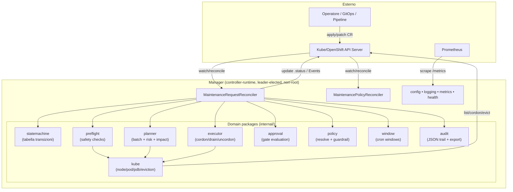
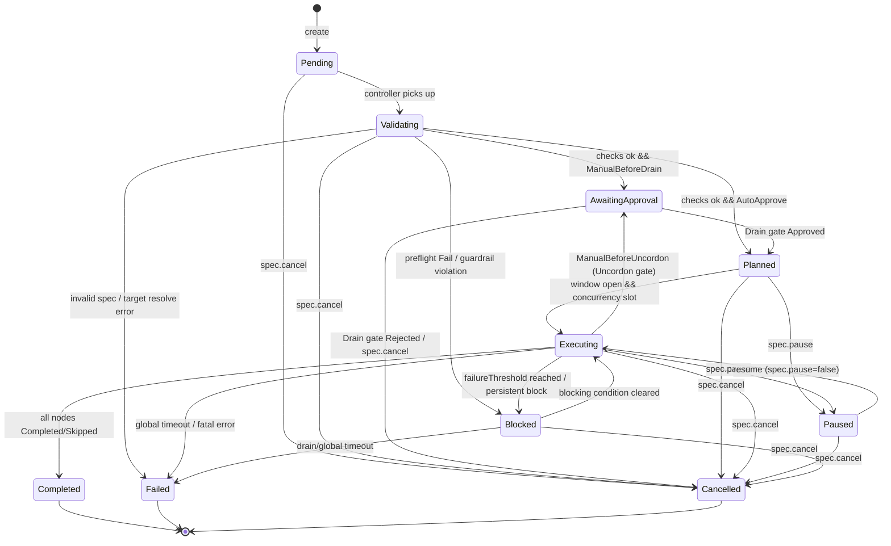
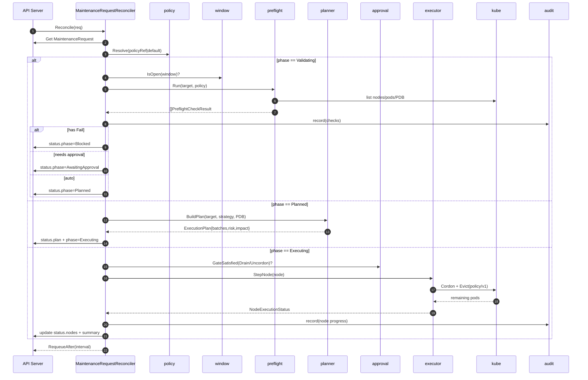

# STEP 1 — Design: Maintenance Orchestrator for Node/Pool Lifecycle

> Documento di design autoritativo per `maintenance.platform.dev/v1alpha1`.
> Linguaggio: **Go** + **controller-runtime**. Target: **Kubernetes** vanilla e **OpenShift**, deploy **in-cluster**.

---

## 1. Decisione architetturale

**Scelta: Opzione 1 — Controller basato su CRD (kubebuilder-style).**

Lo stato dell'intera operazione di manutenzione vive in un oggetto dichiarativo
(`MaintenanceRequest`) persistito in `etcd`; il controller lo riconcilia in modo
idempotente. Le "operazioni" (approve/reject/pause/resume/cancel) non sono chiamate
RPC ma **mutazioni dichiarative di `spec`** applicate con `kubectl/oc patch`.

### 1.1 Confronto delle due opzioni

| Criterio | Opzione 1 — CRD + controller (**scelta**) | Opzione 2 — REST standalone + reconciler interno |
|---|---|---|
| Persistenza stato | `etcd` via API server (nessun DB) | DB esterno o storage proprietario da gestire |
| Resilienza ai restart | Nativa: lo stato è in `.status`, si riprende dall'ultimo punto | Da implementare a mano (WAL/journal, recovery) |
| Concorrenza / HA | Leader election controller-runtime (singolo attivo) | Lock distribuito custom + coda |
| RBAC / AuthN / AuthZ | Nativi K8s (Role/ClusterRole, SubjectAccessReview) | Da costruire (token, middleware, audit) |
| Audit | Audit log dell'API server + Events + managedFields | Da costruire |
| UX operatore | `kubectl/oc get/describe/patch`, GitOps/ArgoCD | Client/SDK dedicato |
| Idempotenza | Modello a riconciliazione, by design | Da garantire manualmente |
| Costo operativo | Basso: un solo Deployment | Più alto: servizio + DB + ingress + auth |
| Svantaggio principale | No long-running blocking → richiede *poll-and-requeue* | Maggiore superficie e codice infrastrutturale |

### 1.2 Perché CRD vince qui

- **Zero infrastruttura aggiuntiva**: niente DB, niente coda, niente ingress. Un solo
  Deployment leader-elected. Il controllo della **concorrenza globale dei drain** è
  banale perché esiste **una sola istanza attiva**.
- **Sicurezza operativa nativa**: ogni transizione passa dall'API server → finisce
  nell'**audit log** del cluster; l'RBAC è quello di Kubernetes (nessun authz custom).
- **GitOps-friendly**: una `MaintenanceRequest` è un manifest; può nascere da pipeline,
  ArgoCD, ticket automation. Le approvazioni sono `patch` tracciabili e firmabili.
- **Compatibilità OpenShift**: le CRD e i controller sono il modello operativo nativo
  di OCP; il runtime gira non-root sotto SCC `restricted-v2`.

### 1.3 Svantaggi e mitigazioni

| Svantaggio del modello CRD | Mitigazione adottata |
|---|---|
| Niente operazioni bloccanti lunghe nel `Reconcile` | **Poll-and-requeue**: il drain non blocca; si avvia l'eviction, si esce e si ri-osserva dopo `EvictionPollInterval` |
| `.status` può crescere | Cap su `status.preflight`/`status.nodes`; dettagli voluminosi solo in audit/log |
| L'"API" non è un endpoint HTTP | Operazioni mappate su campi `spec` + esempi `kubectl/oc patch`; **companion REST opzionale** in roadmap, non necessario |
| Nessun "submit" sincrono con risposta immediata | `DryRun`/`Advisory` producono il verdetto in `.status` entro pochi reconcile |

---

## 2. Modello di esecuzione: *poll-and-requeue*

Nessuna goroutine di background, nessuna coda esterna. Il `Reconcile` è una funzione
**pura rispetto allo stato osservato**: legge `MaintenanceRequest` + cluster, calcola
il prossimo passo, scrive `.status`, e restituisce un `RequeueAfter`.

```
Reconcile(req):
  obj   := get(MaintenanceRequest)
  pol   := resolvePolicy(obj)                 # internal/policy
  switch obj.status.phase:
    Pending           -> validate + window    # -> Validating
    Validating        -> preflight + guardrail # -> AwaitingApproval | Planned | Blocked | Failed
    AwaitingApproval  -> read spec.approval    # -> Planned | Cancelled
    Planned           -> plan + open window?   # -> Executing | Paused
    Executing         -> step batch (cordon/drain/postcheck/uncordon)
                                               # -> Executing | AwaitingApproval(Uncordon) | Completed | Blocked | Failed
    Paused            -> wait resume/cancel     # -> Executing | Cancelled
    Blocked           -> re-evaluate            # -> Executing | Failed | Cancelled
    terminal          -> noop
  writeStatus(obj)
  return RequeueAfter(interval)
```

L'avanzamento di un drain è osservato, non atteso: si avviano le eviction dei pod,
si **ritorna**, e al reconcile successivo si conta quanti pod restano. Questo rende il
controller resiliente ai restart (riprende leggendo `.status`) e non consuma worker.

---

## 3. Diagramma dei componenti



---

## 4. Macchina a stati del lifecycle

I valori coincidono con `api/v1alpha1` (`Phase`): `Pending`, `Validating`,
`AwaitingApproval`, `Planned`, `Executing`, `Paused`, `Blocked`, `Completed`,
`Failed`, `Cancelled`.



### 4.1 Semantica per stato (ingresso / uscita / audit / metriche)

| Stato | Quando ci entra | Quando ne esce | Audit scritto | Metriche aggiornate |
|---|---|---|---|---|
| **Pending** | Alla creazione del CR (status vuoto) | Appena il controller lo osserva | `request.created` (id, mode, target, requestedBy, reason) | `maintenance_requests_total{mode,target_type}` ++ ; `active_maintenances` set |
| **Validating** | Da Pending | Dopo preflight + guardrail | `validating.start`, un record per check (`code`, `status`, `node`) | `preflight_failures_total{check}` ++ per ogni `Fail` |
| **AwaitingApproval** | Validation ok e policy richiede gate (Drain o Uncordon) | Quando arriva la `GateDecision` corrispondente | `approval.requested{gate}` | — (gauge `active_maintenances` resta) |
| **Planned** | Auto-approve oppure Drain gate approvato | Window aperta + slot di concorrenza disponibile | `plan.generated` (batches, riskScore, impact) | — |
| **Executing** | Da Planned (o ritorno da Paused/Blocked/uncordon gate) | Tutti i nodi terminali, o errore/timeout | `node.cordon`, `node.drain.progress`, `node.evicted`, `node.uncordon` | `drain_duration_seconds{result}` osservata a fine nodo ; `blocked_drains_total{reason}` ++ su blocco |
| **Paused** | `spec.pause=true` | `spec.pause=false` (resume) o cancel | `request.paused{by}` | — |
| **Blocked** | Preflight `Fail` non superabile o blocco di esecuzione (PDB, capacity…) oltre soglia | Condizione rientra, oppure timeout → Failed | `request.blocked{reason}` | `blocked_drains_total{reason}` ++ |
| **Completed** | Tutti i nodi `Completed`/`Skipped` | Terminale | `request.completed{summary}` | `maintenance_success_total` ++ ; `active_maintenances` -- |
| **Failed** | Timeout globale, soglia fallimenti, errore fatale | Terminale | `request.failed{reason}` | `maintenance_failure_total{reason}` ++ ; `active_maintenances` -- |
| **Cancelled** | `spec.cancel=true` o gate `Rejected` | Terminale | `request.cancelled{by}` | `active_maintenances` -- |

Le `status.conditions[]` (tipo standard `metav1.Condition`) riflettono in parallelo:
`Validated`, `Approved`, `Planned`, `Executing`, `WindowOpen`, `GuardrailViolation`,
`Completed`, `Blocked`, `Failed`.

---

## 5. Flusso di riconciliazione (sequence)



---

## 6. Modello dati (mappa ai tipi Go esistenti)

Tutti i tipi sono in `api/v1alpha1`. Già presenti e usati come fonte di verità:

| Concetto del prompt | Tipo Go | File |
|---|---|---|
| MaintenanceRequest | `MaintenanceRequest` (`+kubebuilder:resource:scope=Cluster,shortName=mreq`) | `maintenancerequest_types.go` |
| MaintenanceSpec | `MaintenanceSpec` (mode, reason, requestedBy, target, strategy, maxConcurrent, batchSize, drain/globalTimeout, uncordonAfter, window, approval, pause, cancel, policyRef, allowControlPlane, force) | `maintenancerequest_types.go` |
| MaintenanceStatus | `MaintenanceStatus` (phase, conditions, startTime, completionTime, approvalGate, preflight, plan, nodes, summary, message, lastError) | `maintenancerequest_types.go` |
| TargetRef | `TargetRef` (type=Node/NodeSelector/Pool, nodeNames, selector, poolKey/poolValue) | `shared_types.go` |
| PreflightCheckResult | `PreflightCheckResult` (code, node, status=Pass/Warn/Fail, message, details, time) | `shared_types.go` |
| ExecutionPlan | `ExecutionPlan` (strategy, batches, totalNodes, maxConcurrent, riskScore, riskFactors, impact, generatedAt) | `shared_types.go` |
| NodeExecutionStatus | `NodeExecutionStatus` (node, phase, batch, start/end, total/evicted/remaining pods, blockReason, message) | `shared_types.go` |
| ApprovalStatus | `ApprovalSpec` + `GateDecision` + `status.approvalGate` (`Gate`) | `shared_types.go` |
| MaintenancePolicy | `MaintenancePolicy` (`mpol`) + `MaintenancePolicySpec` | `maintenancepolicy_types.go` |
| Config | `config.Config` (default → file → env) | `internal/config/config.go` |

Enum/costanti già definite: `Mode`, `Strategy`, `TargetType`, `ApprovalPolicy`,
`Gate`, `Decision`, `CheckStatus`, `Phase`, `NodePhase`, i `Code*` di preflight, i
`Block*` reason e i `Cond*` condition type.

### 6.1 Modalità operative

| Mode | Mutazioni cluster | Comportamento | Esito |
|---|---|---|---|
| `DryRun` | Nessuna | Risolve target + preflight + plan **una volta**, poi termina | `Completed` con `status.preflight` + `status.plan` (report) |
| `Advisory` | Nessuna | Ri-valuta in continuo target/preflight (monitor) | Resta attivo finché non `Cancelled` |
| `Execute` | Sì | Flusso completo: cordon → drain → post-check → uncordon | `Completed`/`Blocked`/`Failed` |

### 6.2 Strategie di sequencing

| Strategy | Raggruppamento | Concorrenza |
|---|---|---|
| `Serial` | 1 batch da 1 nodo per volta | 1 |
| `Batched` | Batch di `spec.batchSize` nodi | `min(maxConcurrent, batchSize, policy.maxConcurrentDrains)` |
| `ByZone` | Un batch per `topology.kubernetes.io/zone` | per-zona, mai due zone insieme |
| `ByPool` | Un batch per `poolKey=poolValue` (default pool keys) | per-pool |

In tutti i casi la **concorrenza effettiva** è il minimo tra `spec.maxConcurrent`,
la dimensione del batch e `policy.maxConcurrentDrains` (cap globale del cluster).

---

## 7. Struttura del progetto (target finale)

```
maintenance-orchestrator/
├── go.mod
├── go.sum
├── Makefile
├── Dockerfile
├── README.md
├── .dockerignore
├── .gitignore
├── api/
│   └── v1alpha1/
│       ├── groupversion_info.go
│       ├── shared_types.go
│       ├── maintenancerequest_types.go
│       ├── maintenancepolicy_types.go
│       └── zz_generated.deepcopy.go
├── cmd/
│   └── manager/
│       └── main.go                      # bootstrap manager (esistente)
├── internal/
│   ├── config/   config.go              # default → file → env  (esistente)
│   ├── logging/  logging.go             # zap → logr            (esistente)
│   ├── metrics/  metrics.go             # collector Prometheus  (esistente)
│   ├── kube/     nodes.go pods.go eviction.go   # wrapper client (STEP 3)
│   ├── policy/   policy.go              # resolve + guardrail    (STEP 3)
│   ├── window/   window.go              # finestre cron          (STEP 3)
│   ├── preflight/ preflight.go          # safety checks          (STEP 3)
│   ├── planner/  planner.go             # batch + risk + impact  (STEP 3)
│   ├── executor/ executor.go            # cordon/drain/uncordon  (STEP 3)
│   ├── approval/ approval.go            # valutazione gate       (STEP 3)
│   ├── statemachine/ statemachine.go    # tabella transizioni    (STEP 3)
│   ├── audit/    audit.go               # JSON trail + export    (STEP 3)
│   └── controller/                      # reconciler             (STEP 3)
│       ├── maintenancerequest_controller.go
│       └── maintenancepolicy_controller.go
├── deploy/                              # STEP 4
│   ├── crd/        *_maintenancerequests.yaml  *_maintenancepolicies.yaml
│   ├── rbac/       role.yaml (ClusterRole) + binding
│   ├── manager/    namespace serviceaccount clusterrole(binding) deployment
│   │               service configmap networkpolicy servicemonitor
│   └── samples/    policy + esempi MaintenanceRequest
├── hack/
│   ├── boilerplate.go.txt
│   └── config.local.yaml
└── docs/
    └── DESIGN.md                        # questo documento
```

> **Stato attuale del repo:** lo scaffold (STEP 2) è stato riorganizzato in questo
> layout. Mancano i package di dominio sotto `internal/` e `deploy/` → STEP 3/4.
> `go build ./...` fallisce **solo** su `cmd/manager` perché importa
> `internal/controller`, assente fino allo STEP 3 (per design).

---

## 8. API/CRD design: operazioni come patch dichiarative

Niente endpoint REST: ogni operazione del prompt è un campo di `spec`.

| Operazione (prompt) | Espressione CRD-native |
|---|---|
| `POST /maintenance-requests` | `kubectl apply -f mreq.yaml` |
| `GET  /maintenance-requests[/{id}]` | `kubectl get mreq [name] -o yaml` |
| `POST /{id}/approve` (Drain) | `oc patch mreq NAME --type=merge -p '{"spec":{"approval":{"gates":[{"gate":"Drain","decision":"Approved","approvedBy":"alice"}]}}}'` |
| `POST /{id}/reject` | come sopra con `"decision":"Rejected"` |
| `POST /{id}/pause` | `kubectl patch mreq NAME --type=merge -p '{"spec":{"pause":true}}'` |
| `POST /{id}/resume` | `... '{"spec":{"pause":false}}'` |
| `POST /{id}/cancel` | `... '{"spec":{"cancel":true}}'` |

### 8.1 Esempio `MaintenancePolicy` (guardrail di cluster)

```yaml
apiVersion: maintenance.platform.dev/v1alpha1
kind: MaintenancePolicy
metadata:
  name: cluster-default
spec:
  protectControlPlane: true
  controlPlaneNodeLabels:
    - node-role.kubernetes.io/control-plane
    - node-role.kubernetes.io/master
  maxConcurrentDrains: 1
  maxUnavailablePercent: 20
  reservedNodeLabels: ["maintenance.platform.dev/pinned"]
  reservedTaints: ["dedicated"]
  minCapacityHeadroomPercent: 15
  allowForceEviction: false
  defaultApprovalPolicy: AutoApprove
  failureThreshold: 1
  allowedWindows:
    - cron: "0 2 * * *"      # 02:00
      duration: 3h
      timeZone: "Europe/Rome"
```

### 8.2 Esempio `MaintenanceRequest` (pool, rolling, approvazione)

```yaml
apiVersion: maintenance.platform.dev/v1alpha1
kind: MaintenanceRequest
metadata:
  name: worker-pool-kernel-patch
spec:
  mode: Execute
  reason: "Kernel CVE-2025-XXXX patch"
  requestedBy: "alice@example.com"
  target:
    type: Pool
    poolKey: "machine.openshift.io/cluster-api-machineset"
    poolValue: "ocp-prod-worker-a"
  strategy: ByPool
  maxConcurrent: 1
  uncordonAfter: true
  approval:
    policy: ManualBeforeDrain
  maintenanceWindow:
    cron: "0 2 * * 6"        # sabato 02:00
    duration: 4h
    timeZone: "Europe/Rome"
  policyRef:
    name: cluster-default
```

---

## 9. Scelte tecniche motivate

1. **Eviction via `policy/v1`** (non `DELETE` diretto): rispetta i PodDisruptionBudget
   by design. La force-eviction (delete) è **doppiamente gated**: richiede
   `spec.force=true` **e** `policy.allowForceEviction=true`. Default: off.
2. **Cordon prima del drain**: `spec.unschedulable=true` con `Patch` idempotente prima
   di evictare; l'uncordon avviene **solo** dopo post-check positivo o policy esplicita.
3. **Protezione control-plane**: i nodi con `controlPlaneNodeLabels` sono `Skipped`/`Fail`
   salvo `spec.allowControlPlane=true` **e** policy che non forza `protectControlPlane`.
4. **Concorrenza globale**: garantita dall'unica istanza leader-elected che conta i nodi
   in drain attraverso *tutte* le request prima di occupare uno slot (`maxConcurrentDrains`).
5. **Finestre cron**: parser a 5 campi + `duration` + `timeZone` IANA; un nodo non entra
   in `Executing` fuori finestra (condition `WindowOpen=false`, requeue all'apertura).
6. **Risk score & impact**: il planner calcola un punteggio 0–100 (single-replica,
   emptyDir, PDB stretti, % unavailable, control-plane) e una stima d'impatto
   (`podsToEvict`, `appsAffected`, `singleReplicaWorkloads`, `emptyDirPods`) — utile in
   `DryRun` come *simulazione*.
7. **Rilevazione casi speciali**: DaemonSet (ignorati come `kubectl drain`), static/mirror
   pod (`kubernetes.io/config.mirror`), emptyDir, local storage, MCO OpenShift
   (`machineconfiguration.openshift.io/state`) → nodo `Skipped` se già in update.
8. **Coesistenza autoscaler/MCO**: l'orchestratore **non** li pilota; rileva nodi già
   `unschedulable` o gestiti e li salta, evitando race con cluster-autoscaler.
9. **RBAC minimo**: `get/list/watch/patch` su `nodes`; `list` su `pods`; `create` su
   `pods/eviction`; `get/list` su `poddisruptionbudgets`; CRUD su CRD del gruppo +
   `*/status`; `create/patch` su `events`; `leases` per la leader election.
10. **Runtime hardened**: distroless non-root (uid 65532), binario statico read-only,
    compatibile SCC OpenShift `restricted-v2`.

---

## 10. Tracciabilità requisiti → componenti

| Requisito (prompt) | Componente |
|---|---|
| A. Maintenance Request API | CRD `MaintenanceRequest` + `internal/controller` |
| B. Preflight checks | `internal/preflight` (+ `internal/kube`, `internal/window`, `internal/policy`) |
| C. Drain planner | `internal/planner` |
| D. Drain executor | `internal/executor` (+ `internal/kube` eviction) |
| E. Pool lifecycle (rolling, pause/resume/cancel, blast radius) | `internal/controller` + `internal/planner` + `internal/policy` |
| F. Approval workflow | `internal/approval` + `spec.approval` + `status.approvalGate` |
| G. Audit & observability | `internal/audit` + `internal/metrics` + Events + `/healthz` `/readyz` |
| H. Safety guardrails | `internal/policy` + `internal/preflight` |
| Extra (windows, risk, impact, JSON export, label selector) | `internal/window`, `internal/planner`, `internal/audit` |

---

## 11. Assunzioni dichiarate

- **Pool membership** dedotta da label-key dei nodi (`config.DefaultPoolKeys`: MachineSet
  OpenShift, EKS nodegroup, GKE nodepool, AKS agentpool, Karpenter), **non** da API cloud
  → vendor-neutral, niente credenziali provider.
- **Capacity check** euristico basato su `requests` e headroom percentuale, **non** una
  simulazione completa dello scheduler.
- **Single-replica** dedotto dagli `ownerReferences` (ReplicaSet/StatefulSet) e dal numero
  di repliche ready sui nodi non in manutenzione.
- **Static/mirror pod** riconosciuti da annotation `kubernetes.io/config.mirror`.
- **Nessun DB**: lo stato è interamente in `.status`; i dettagli voluminosi vanno in
  audit/log, non nel CR.
- **Approvazioni dichiarative**: via `patch` su `spec.approval.gates`; un companion REST
  è opzionale e fuori scope di v1alpha1.
- **Module path** `github.com/Sindi98/maintenance-orchestrator` mantenuto dallo scaffold.

---

## 12. Prossimi step

- **STEP 2** — *Completato*: scaffold riorganizzato nel layout sopra (api, cmd, internal,
  hack). I file iniziali (tipi, config, logging, metrics, main, Dockerfile, Makefile,
  README) sono in posizione e coerenti.
- **STEP 3** — Logica core: `internal/{kube,policy,window,preflight,planner,executor,approval,statemachine,audit,controller}`.
- **STEP 4** — Manifest: CRD, RBAC, Deployment/Service/ConfigMap, NetworkPolicy,
  ServiceMonitor, samples.
- **STEP 5** — Test: preflight, planner, statemachine, approval.
- **STEP 6** — README finale dettagliato.

